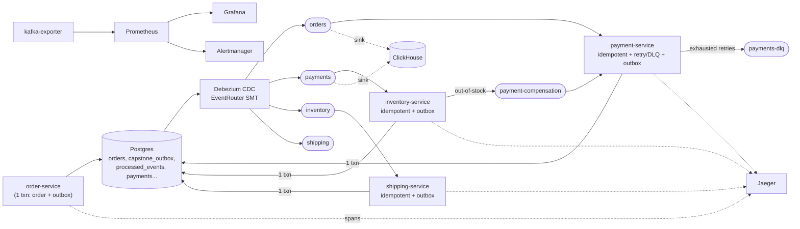

# Orderweave

Orderweave is the capstone of [kafkaos](./README.md), a 25-stage hands-on
Kafka learning project. It's what you get when you take four
independently-proven distributed-systems patterns — idempotent
consumption, the transactional outbox, retry-with-DLQ, and saga
compensation — and weave them into one order-processing pipeline instead
of leaving them as four separate demos that happen to share a repo.

This document is self-contained: you don't need to have read
[`NOTES.md`](./NOTES.md) (the full, chronological project journal) to
understand what Orderweave does or how to verify any claim made here.
Every number below came from a command that was actually run against a
real Postgres, a real Kafka broker, and a real ClickHouse instance — cross
-checked across at least two of those three systems wherever a number
matters. Nothing here is estimated or carried over from a smaller test.

## What it proves

An `orders → payment → inventory → shipping` e-commerce pipeline that:

1. **Never double-charges or double-ships**, even when a consumer crashes
   mid-batch and Kafka redelivers the same message.
2. **Never loses an event**, even though the database write and the Kafka
   publish are two physically separate systems with no shared transaction.
3. **Degrades gracefully under a real downstream outage** — retries with
   backoff, then a DLQ, instead of an infinite retry loop or a silent drop.
4. **Reverses a partially-completed order** — a payment that succeeded but
   was followed by an out-of-stock inventory failure gets an actual
   refund, not just a log line.
5. **Processes 2,000,000 orders** end-to-end, with every claim above still
   holding at that volume, measured directly.

## Architecture



Four services, one shared Postgres database, one Kafka cluster. No
service ever calls another service directly — every hop is a database
write, relayed to Kafka by Debezium, consumed independently downstream.
This is the same choreography shape Stage 6 established on day one; what
Orderweave adds is making every hop safe under redelivery, downstream
failure, and partial rollback.

## The four guarantees, and how to verify each one yourself

All commands assume `docker compose up -d` is running and
`npm run orderweave:order`, `orderweave:payment`, `orderweave:inventory`,
`orderweave:shipping` are each running in their own terminal (see
[How to run it](#how-to-run-it) below).

### 1. Idempotent consumption — redelivery never double-applies

Every consumer (`payment-service`, `inventory-service`,
`shipping-service`) inserts a row into `processed_events` — keyed on
`(topic, partition, offset)`, the message's actual delivery identity, not
a business ID — in the **same transaction** as the side effect it guards.
A duplicate delivery hits a primary-key conflict on the insert, rolls
back cleanly, and is recorded as `"duplicate"` rather than reapplied.

**Verify it**: kill `payment-service` mid-burst (`kill -9`, the real
process — see the [incident walkthrough](#the-incident-kill-payment-
service-mid-burst) below for exactly how this was captured), restart it,
and query:

```sql
SELECT count(*) FROM payments WHERE order_id = '<the in-flight order>';
-- 1, even though Kafka redelivered the uncommitted-offset message
```

### 2. The transactional outbox — the DB write and the Kafka publish can never diverge

Every service writes its business row and a `capstone_outbox` row in one
Postgres transaction. Debezium — a separate process, watching Postgres's
write-ahead log via logical replication — is what actually publishes to
Kafka, completely decoupled from whether the application process is even
still running by the time the message goes out. Two independent
connectors (`outbox-postgres-source` for Stage 23's older demo,
`orderweave-outbox-postgres-source` for this one) run against two
physically separate outbox tables (`outbox` vs. `capstone_outbox`) — a
real failure mode caught during assembly was two Debezium connectors
sharing one outbox table, which cross-published each other's rows.

**Verify it**: `docker exec -i postgres psql -U kafkaos -d kafkaos -c
"SELECT * FROM capstone_outbox ORDER BY id DESC LIMIT 5;"` next to
`docker exec kafka /opt/kafka/bin/kafka-console-consumer.sh
--bootstrap-server localhost:9092 --topic orders --from-beginning
--max-messages 5` — the same rows, independently confirmed present in
both systems.

### 3. Retry with backoff, then a DLQ — scoped to where it's actually correct

`payment-service` retries a failed downstream call with exponential
backoff (200ms → 400ms → …), up to `MAX_ATTEMPTS`, then routes the
message to `payments-dlq`. This is deliberately **not** applied
everywhere: a declined payment is a business decision (retrying a
declined card doesn't make it valid) and skips straight to recording a
failure; an out-of-stock inventory reservation is likewise a business
outcome, handled by compensation (#4), not retried.

**Verify it**: `npm run orderweave:order` seeds a deterministic
`order-permanent-fail-*` order; `payment-service`'s own log shows the
attempt/backoff sequence, and `payments-dlq` receives exactly one message
for it:

```
[payment-service] order=order-permanent-fail-xxx attempt 1/3 failed (...), retrying in 200ms
[payment-service] order=order-permanent-fail-xxx attempt 2/3 failed (...), retrying in 400ms
[payment-service] order=order-permanent-fail-xxx -> EXHAUSTED 3 attempts (applied), routed to payments-dlq
```

### 4. Saga compensation — a partial failure gets reversed, not just logged

An `order-out-of-stock-*` order succeeds at payment, then fails inventory
reservation. `inventory-service` publishes a compensation request to
`payment-compensation` (a topic separate from the original payment
request — this avoids the self-referential "don't reprocess your own
refund" guard an earlier, single-topic version of this pattern needed).
`payment-service` reacts independently and issues a real refund row.

**Verify it**:

```sql
SELECT p.status, r.status FROM payments p JOIN refunds r USING (order_id)
WHERE order_id = 'order-out-of-stock-xxx';
-- succeeded | issued
```

## Observability

- **Distributed tracing** (Jaeger): trace context is embedded as a
  `traceContext` field inside the outbox payload's JSON, not in Kafka
  message headers — Debezium, not the application process, physically
  produces the eventual Kafka message, so there are no headers of ours to
  set at that point. One order's trace was pulled directly from Jaeger's
  own API and its span parent/child chain checked programmatically,
  confirming the connected span chain survives the outbox/Debezium hop —
  including a real, non-zero CDC-relay latency gap between one service's
  span ending and the next one starting, not simulated.
- **Grafana** (`orderweave-overview.json`): pipeline funnel (a lagging
  hop visibly bulges), compensation rate, DLQ messages, the
  duplicate-vs-applied outcome ratio (the incident demo's visual
  centerpiece), and consumer lag by group.
- **Prometheus + Alertmanager**: `OrderweaveConsumerLagHigh` fires when
  `payment-service`'s lag exceeds 20 messages for 10 continuous seconds
  (the `for:` duration matters — a shorter window fires on normal
  fetch-batch noise, a lesson first learned the hard way in Stage 22).

## The incident: kill `payment-service` mid-burst

With all four services and the full monitoring stack running against a
continuous order burst, the real `payment-service` process was killed
(`kill -9`, not a graceful shutdown — and the real OS process, found via
`ps -p <pid> -o pid,command`, since the PID a backgrounded `npm run`
returns is npm's own wrapper, not the actual `ts-node` process
underneath). Captured, at every step, via direct API/SQL evidence:

- `payment-service`'s consumer group lag climbing in Grafana while
  `orders` kept flowing uninterrupted — the topic-as-buffer property
  Stage 6 first demonstrated, now visible at fleet scale.
- `OrderweaveConsumerLagHigh` transitioning to `firing`, confirmed
  independently in both Prometheus's (`/api/v1/rules`) and
  Alertmanager's own APIs — the same two-hop verification Stage 22
  established.
- On restart, the redelivered in-flight message recorded as
  `"duplicate"` in `processed_events`, with **exactly one** row in
  `payments` for that order despite Kafka redelivering it twice.
- The lag panel draining back to zero and the alert resolving.

## The load test: 2,000,000 messages

**The real, measured problem first**: strict one-Postgres-transaction-
per-message — the same granularity that makes the guarantees above easy
to verify one message at a time — measured at roughly **4–5
messages/sec** once real transactions were in the critical path (two
independent rehearsal measurements agreed on this order of magnitude).
At that rate, 2,000,000 messages would take **over four days**. Nowhere
close to Stage 13's raw-Kafka 74,000–108,000 msg/s, and that gap is the
finding, not something to gloss over.

**The fix directly applies Stage 13's own conclusion — batching is the
dominant Kafka throughput lever — to the Postgres side of the pipeline,
not just the producer side.** Two load-test-only variants
(`order-producer-batched.ts`, `payment-service-batched.ts`) replace one
transaction per message with one transaction per batch of a few thousand
messages: multi-row `INSERT`s via `UNNEST`, and — for the dedup ledger —
`INSERT ... ON CONFLICT DO NOTHING`, so only genuinely-new deliveries
within a batch flow into the business tables. The strict,
one-message-at-a-time services used for the four guarantees above are
**untouched** — this is a deliberate, documented scale trade-off for the
load test specifically, not a replacement.

**The real run**, against a freshly truncated Postgres:

```
[order-producer-batched] DONE: 2000000 orders in 85.0s (23532 orders/sec avg)
```

Consumer catch-up, measured via `kafka-consumer-groups.sh --describe`
against the real `payment-service` group: **zero lag on all three
partitions within 181 seconds total wall-clock** from the start of
production — the batched consumer was already 68% caught up before the
producer even finished, i.e. production and consumption overlapped
almost the entire run, not a sequential produce-then-drain.

Correctness at scale, queried directly:

| Table | Count |
|---|---|
| `payments` | 2,000,000 |
| `processed_events` | 2,000,000 |
| `capstone_outbox` | 4,000,000 (2M `OrderCreated` + 2M `PaymentSucceeded`) |

Exact 1:1 counts — zero duplicates, zero lost messages. The batching
itself: only **132** Postgres transactions committed all 2,000,000
messages (average batch ≈15,151 rows; min 3, max 17,086) — roughly a
**2,400x** reduction in transaction count versus the strict, one-message
-at-a-time approach.

**A third, independent confirmation**, via ClickHouse (below), not just
Postgres and Kafka:

```sql
SELECT count() FROM orderweave_orders   WHERE order_id LIKE 'order-happy-loadtest-<run-tag>-%'; -- 2000000
SELECT count() FROM orderweave_payments WHERE order_id LIKE 'order-happy-loadtest-<run-tag>-%'; -- 2000000
```

**A real operational cost, not hidden**: `kafka-connect` (Debezium)
memory grew to ~2.4GiB relaying the CDC load; total Docker stack memory
peaked around ~6.1GiB, still under this machine's documented ~7.661GiB
ceiling, but a real, measured cost of the outbox pattern at this volume
worth knowing before choosing it at even larger scale.

## ClickHouse: a live analytics sink, and three more real failures

`orders`/`payments` feed a ClickHouse sink for real analytical queries —
reusing Stage 15's Kafka-engine-table → materialized-view → MergeTree
mechanism (not the Kafka Connect sink Stage 15 also proved, and not what
the original plan called for — see below for why).

The double-JSON-encoding quirk from the outbox pattern (Postgres stores
the outbox `payload` as a JSON *string*, not object, so the eventual
Kafka message value is a JSON string literal, not an object) broke the
"obvious" approach twice before landing on what actually works:

1. **`kafka_format = 'JSONAsString'`**, despite its name, requires the
   top-level JSON value to be an object — confirmed via `Code: 117: JSON
   object must begin with '{'` once `kafka_skip_broken_messages` (which
   had been silently swallowing every single message) was removed to let
   the real error surface.
2. Switching to `kafka_format = 'RawBLOB'` (verbatim bytes, zero
   validation) fixed parsing, but backfilling the ~4.1M pre-existing
   messages across both topics through a Kafka engine table with an
   **inline** JSON-unwrapping materialized view **OOM-killed the
   container twice**, even with several GiB of free headroom at crash
   time. Fixed by splitting into two phases: ingest raw bytes only
   (`clickhouse-schema.sql` — confirmed stable, memory barely above
   baseline for the full ~4.1M-row backfill), then parse via a single,
   controllable batch `INSERT ... SELECT` afterward
   (`clickhouse-parse.sql`) — decoupling "capture the data safely" from
   "shape it," instead of doing both live during the highest-volume
   phase.

One real analytical query, timed via ClickHouse's own `--time` flag (not
a stopwatch):

```sql
SELECT status, count(), sum(amount) FROM orderweave_payments
WHERE order_id LIKE 'order-happy-loadtest-<run-tag>-%' GROUP BY status;
-- succeeded | 2000000 | 50000000        -- 0.045s
```

## Scale-informed configuration

None of the following are framework defaults — each traces back to a
number a earlier stage in this project actually measured:

- **`COMPRESSION=zstd`, `ACKS=1`, batch size 2000** for the load-test
  producer — Stage 13's own measured optimum for this exact machine and
  broker.
- **Batched Postgres commits over `eachBatch`**, not `eachMessage`, for
  the load test — the direct consequence of measuring (not assuming)
  that per-message transactions cap out around single-digit msg/s, and
  Stage 13's finding that batching is Kafka's dominant throughput lever
  generalizing to the database side of a pipeline too.
- **`processed_events` keyed by `(topic, partition, offset)`**, not a
  business ID — a deliberate choice (Stage 21) to dedup on delivery
  identity, which is what Kafka actually guarantees uniqueness of, rather
  than inventing a business-level idempotency key.
- **Alert `for:` durations tuned to the real evaluation interval**
  (Stage 22's hard-learned lesson, reapplied in `orderweave_alerts.yml`)
  — too short and an alert fires on ordinary fetch-batch noise.

## Deliberately out of scope

- **MinIO / claim-check (Stage 20)** stays documented, not wired into
  Orderweave — there's no genuinely large payload anywhere in this data
  model (an order is a handful of small fields), and inventing one to
  justify the pattern would be new business logic, not assembly.
- **`inventory-service`/`shipping-service` batched variants** — the load
  test targets the `orders → payment` hop specifically, Orderweave's most
  complex service and its only one with retry logic. The same batching
  technique used for `payment-service-batched.ts` is structurally
  identical for the other two services; duplicating it three times would
  prove the same point three times over, not a new one.
- **A production secrets/config story** — credentials here are the same
  local-dev defaults (`kafkaos`/`kafkaos`) used across every stage in
  this project; real secret management was never this project's subject.

## How to run it

```bash
docker compose up -d          # everything: Kafka, Postgres, Debezium, ClickHouse, Grafana, ...
npm install
docker exec -i postgres psql -U kafkaos -d kafkaos < orderweave/db/postgres/schema.sql
./orderweave/connect/apply-connectors.sh

# four terminals, one service each:
npm run orderweave:order
npm run orderweave:payment
npm run orderweave:inventory
npm run orderweave:shipping
```

Grafana: `localhost:3000` → **Orderweave Overview** dashboard.
Prometheus: `localhost:9090`. Jaeger: `localhost:16686`. Kafka UI:
`localhost:8080`.

For the ClickHouse sink specifically: `./orderweave/scripts/apply-clickhouse.sh`
(two phases, pauses for you to confirm the raw backfill has settled before
parsing — see [the ClickHouse section](#clickhouse-a-live-analytics-sink-and-three-more-real-failures) above for why).

For the load test specifically:

```bash
COUNT=2000000 BATCH_SIZE=2000 npm run orderweave:load-test
npm run orderweave:payment-batched   # instead of orderweave:payment
```

## Appendix: topic / service map

| Topic | Producer | Consumer(s) | Purpose |
|---|---|---|---|
| `orders` | Debezium (from `capstone_outbox`) | `payment-service` | New order events |
| `payments` | Debezium (from `capstone_outbox`) | `inventory-service` | Payment outcome events |
| `inventory` | Debezium (from `capstone_outbox`) | `shipping-service` | Reservation outcome events |
| `shipping` | Debezium (from `capstone_outbox`) | *(terminal — ClickHouse-eligible, not wired)* | Shipment events |
| `payments-dlq` | `payment-service` | *(manual inspection)* | Exhausted-retry payment failures |
| `payment-compensation` | `inventory-service` | `payment-service` | Refund requests after out-of-stock |

| Component | Role |
|---|---|
| Postgres | System of record for `orders`, `payments`, `inventory_reservations`, `shipments`, `refunds`, `capstone_outbox`, `processed_events` |
| Debezium (Kafka Connect) | Reads Postgres's WAL, publishes `capstone_outbox` rows to Kafka via the `EventRouter` SMT |
| Kafka | Transport + durable buffer between every hop |
| ClickHouse | Analytical sink for `orders`/`payments`, independent of the OLTP path |
| Jaeger | Distributed trace storage/query |
| Prometheus + Alertmanager | Metrics + alerting |
| Grafana | Dashboards |
